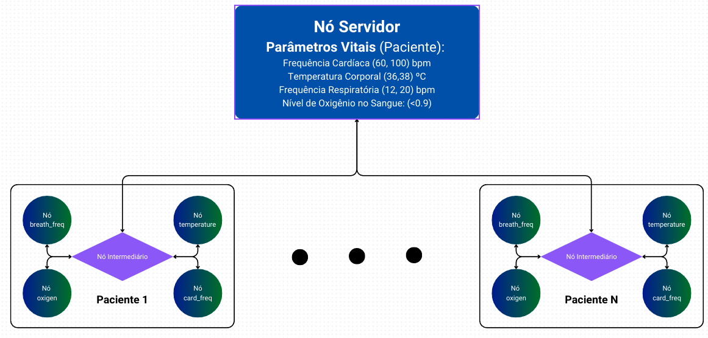

# Redes Sem Fio
[](https://github.com/jpvt/wireless-networks/blob/main/LICENSE)
[](https://www.linkedin.com/in/jpvt/)
[](README_ptbr.md)

Repositório dedicado ao curso de Redes Sem Fio realizado na Universidade Federal da Paraíba. Nesta disciplina, criamos experimentos usando o ns-3. A estrutura do projeto é baseada no [Simulador de Rede de Alejandro Gomez](https://github.com/alejandrogomez314/network-simulator).  Os experimentos são implementados no diretório de cenários, onde cada cenário possui seu próprio arquivo `docker compose` para configurar os contêineres e volumes necessários. As simulações podem ser executadas usando scripts que configuram as interfaces de rede do linux necessárias no host e as conectam aos contêineres em execução e à simulação.

## Sumário
- [Redes Sem Fio](#redes-sem-fio)
  - [Sumário](#sumário)
  - [Requisitos](#requisitos)
  - [Instalação](#instalação)
  - [Scenarios](#scenarios)
    - [Hello World](#hello-world)
    - [Smart Hospital](#smart-hospital)
      - [**Nós**](#nós)
      - [**Dados do Servidor**](#dados-do-servidor)
      - [**Arquivos**](#arquivos)
      - [**Executando o cenário**](#executando-o-cenário)

## Requisitos

1. Linux or MacOS
   
   :warning: Aviso: Esta instalação foi testada apenas no `Linux` (mas deve funcionar bem para `MacOS` também).

2. `docker` -  https://docs.docker.com/get-docker/

3. `docker compose` -  https://docs.docker.com/compose/install/

4. `git` instalado pela sua distribuição Linux ou macOS (ex:  `HomeBrew`)

## Instalação

1. Instale o  [`docker`](https://docs.docker.com/get-docker/) and verify installation. e verifique a instalação. Deve ser possível executar a imagem `hello-world`:

    ```console
    foor@bar# sudo docker run hello-world

    Hello from Docker!
    This message shows that your installation appears to be working correctly.

    To generate this message, Docker took the following steps:
    1. The Docker client contacted the Docker daemon.
    2. The Docker daemon pulled the "hello-world" image from the Docker Hub.
        (amd64)
    3. The Docker daemon created a new container from that image which runs the
        executable that produces the output you are currently reading.
    4. The Docker daemon streamed that output to the Docker client, which sent it
        to your terminal.

    To try something more ambitious, you can run an Ubuntu container with:
    $ docker run -it ubuntu bash

    Share images, automate workflows, and more with a free Docker ID:
    https://hub.docker.com/

    For more examples and ideas, visit:
    https://docs.docker.com/get-started/
    ```

2. Clone o repositório. Exemplo usando SSH:

    ```console
    foo@bar# git clone git@github.com:jpvt/wireless-networks.git
    ```

3. Prepare o script `hello_world.sh` para ser executado:

    ```console
    foo@bar# chmod a+x scripts/hello_world.sh
    ```

4. Execute o script `hello_world.sh`:

    :warning: Aviso: Na primeira execução, isso deve levar cerca de ~22 minutos numa conexão de 300Mbps.

    ```console
    foo@bar# ./scripts/hello_world.sh

    ns3  | -- Configuring done
    ns3  | -- Generating done
    ns3  | -- Build files have been written to: /usr/local/ns-allinone-3.37/ns-3.37/cmake-cache
    ns3  | Scanning dependencies of target scratch_hello
    ns3  | [  0%] Building CXX object scratch/CMakeFiles/scratch_hello.dir/hello.cc.o
    ns3  | [  0%] Linking CXX executable ../../build/scratch/ns3.37-hello-default
    ns3  | At time +2s client sent 1024 bytes to 10.1.1.2 port 9
    ns3  | At time +2.00369s server received 1024 bytes from 10.1.1.1 port 49153
    ns3  | At time +2.00369s server sent 1024 bytes to 10.1.1.1 port 49153
    ns3  | At time +2.00737s client received 1024 bytes from 10.1.1.2 port 9
    ns3 exited with code 0
    Done
    ```

## Scenarios

### Hello World

Este é um cenário de teste para verificar se sua configuração está funcionando corretamente. Não há muito o que fazer aqui. Arquivos neste cenário:

- script: `hello_world.sh`
- docker compose: `scenarios/hello-world.yaml`
- arquivo src: `hello.cc`
- imagem: `ns3.Dockerfile`

### Smart Hospital

Neste cenário, um hospital inteligente é equipado com uma rede de Internet das Coisas (IoT) para monitorar continuamente os parâmetros vitais dos pacientes e responder a eventos em tempo real para melhorar a qualidade do atendimento ao paciente.


*Nota: os intervalos dos parâmetros vitais podem mudar de acordo com os dados do paciente.*

#### **Nós**

1. **Nós Sensores:** Esses nós estão associados aos pacientes e são responsáveis por monitorar continuamente os parâmetros vitais dos pacientes, como frequência cardíaca, pressão arterial, temperatura corporal, taxa respiratória e níveis de oxigênio no sangue.

2. **Nó Servidor:** Este nó recebe leituras dos nós sensores. Ele tem regras predefinidas para identificar leituras normais e anormais. Quando uma leitura anormal é detectada, o nó servidor identifica isso como um evento.

3. **Nós Atuadores:** Esses nós estão associados a várias ações que podem ser necessárias em resposta a um evento. Por exemplo, pode haver um nó atuador associado a um robô que entrega medicamentos aos pacientes.

4. **Nós Intermediários:** Esses nós facilitam a comunicação entre os nós sensores, o nó servidor e os nós atuadores.

#### **Dados do Servidor**

O nó servidor armazena e processa os parâmetros vitais dos pacientes, que são continuamente monitorados pelos nós sensores. Isso inclui a frequência cardíaca dos pacientes, pressão arterial, temperatura corporal, taxa respiratória e níveis de oxigênio no sangue.

#### **Arquivos**

- script: `hospital.sh`
- docker compose: `scenarios/hospital.yaml`
- arquivo src: `hospital.cc`
- logs: `data/hospital_logs.txt`
- dados do servidor: `data/patients_data.csv`
- entrada de teste: `data/sensor_readings.csv`
- imagem: `ns3.Dockerfile` 

#### **Executando o cenário**

1. Prepare o script `hospital.sh` para ser executado:

    ```console
    foo@bar# chmod a+x scripts/hospital.sh
    ```

2. Execute o script `hospital.sh`:

    :warning: Aviso: Se esta é a primeira vez que você está construindo a imagem, isso deve levar cerca de ~22 minutos numa conexão de 300Mbps.

    ```console
    foo@bar# ./scripts/hospital.sh
    ```